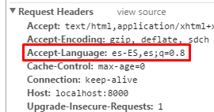

+++
categories = ['howto', 'django']
date = "2016-09-02T02:00:00Z"
description = "There's a reliable way to test out Django's localizations thanks to Chrome."
keywords = ['django', 'localization', 'internationalization', 'chrome']
title = "Testing Django Localization with Chrome"
hasCode = true
+++

TL;DR: <a href="#tldr">Just take me to the good stuff!</a>

A project I've started working on has required me once again to jump into the fun-filled world that is internationalization (i18n) and localization (l10n). This is my first foray into Django's i18n and l10n support and so far I've been _very_ impressed with it. It has been [_incredibly_ easy to set up and integrate](https://docs.djangoproject.com/en/1.10/topics/i18n/translation/), and though I haven't used it yet I was floored to discover that Django includes support for [Javascript content localization](https://docs.djangoproject.com/en/1.10/topics/i18n/translation/#internationalization-in-javascript-code). Talk about batteries included!

> NOTE: from here on I'm going to assume you have a functioning Django project, have [set](https://docs.djangoproject.com/en/1.10/ref/settings/#use-i18n) [all](https://docs.djangoproject.com/en/1.10/ref/settings/#use-l10n) [of](https://docs.djangoproject.com/en/1.10/ref/settings/#std:setting-LANGUAGE_CODE) [the](https://docs.djangoproject.com/en/1.10/ref/settings/#locale-paths) [appropriate](https://docs.djangoproject.com/en/1.10/ref/settings/#languages) [values](https://docs.djangoproject.com/en/1.10/topics/i18n/translation/#how-django-discovers-language-preference) in `settings.py`, have created an app with `` tags sprinkled about its templates, and have [generated](https://docs.djangoproject.com/en/1.10/ref/django-admin/#django-admin-makemessages) and [compiled](https://docs.djangoproject.com/en/1.10/ref/django-admin/#compilemessages) even just a few translations.

Once I got localizations up and running, though, I struggled with finding a simple way to view the site in a particular language. Ideally this could be done with either no changes to the existing codebase, or by temporarily overriding a single `settings.py` variable.

First I tried manually changing `LANGUAGE_CODE` in `settings.py`. This didn't have any effect, though. It turns out that this setting is only used as a fallback. When other means of detecting locale are ineffectual, Django will serve up the site using this value as the default language.

After some tinkering, I discovered that the `django.middleware.locale.LocaleMiddleware` was the reason why this didn't work: this middleware performs additional locale detection steps, and if it can't detect one then it falls back to using `LANGUAGE_CODE`. Removing this middleware from `MIDDLEWARE` in `settings.py` allowed me to change the website language by changing the value of `LANGUAGE_CODE`, but then I'd have to remember to re-add the middleware when I was done testing. This wasn't ideal at all.

At this point I came across a blurb about how `LocaleMiddleware` detects your locale to determine what language to serve:

> "...it looks at the Accept-Language HTTP header. This header is sent by your browser and tells the server which language(s) you prefer, in order by priority" [^1]

The goal then became to figure out how to tweak Chrome to get it to send an appropriate value for `Accept-Language` that would "trick" `LocaleMiddleware` into serving up the desired language.

In another stroke of luck, the Chrome Developers site has an entire section dedicated to i18n support. I quickly found [these instructions](https://developer.chrome.com/extensions/i18n#locales-testing) that detailed how exactly you can start up Chrome in another language.

<span id="tldr"></span>
For **Windows**, create a **shortcut** and set a couple of flags:

```sh
path_to_chrome.exe --lang=[locale] --user-data-dir=[c:\locale_profile_dir]
```

Swap out `[locale]` for one of the `LANGUAGES` you set up in `settings.py`, and `[c:\locale_profile_dir]` with wherever on your filesystem you want this locale-specific Chrome profile to reside

For **Linux**, set the `LANGUAGE` environment variable before invoking Chrome:

```sh
LANGUAGE=es ./chrome
```

This can easily be dropped into a `.sh` script, or even set up as an alias in `.bash_aliases`.

**Mac OS X** requires you to [tweak your locale via System Preferences](https://developer.chrome.com/extensions/i18n#testing-mac):

> 1. From the Apple menu, choose System Preferences
> 2. Under the Personal section, choose International
> 3. Choose your language and location
> 4. Restart Chrome

(I feel as though there must be a cleaner way to do this on Mac, but I'm unable to experiment with this myself. If you know a better way, let me know and I'll update accordingly)

When you're done, start your localized Chrome and visit your Django site. You should now see the site translated into the matching locale. You can confirm the new value of the `Accept-Language` header via Chrome's **Dev Tools > Network** tab:



This is by far the most convenient way to visualize a Django site's localizations during local development. And best of all, I didn't have to make any changes to the Django codebase, so I know that what I'm seeing is what other users will see when the site goes live. That's all there is to it!

[^1]: https://docs.djangoproject.com/en/1.10/topics/i18n/translation/#how-django-discovers-language-preference
