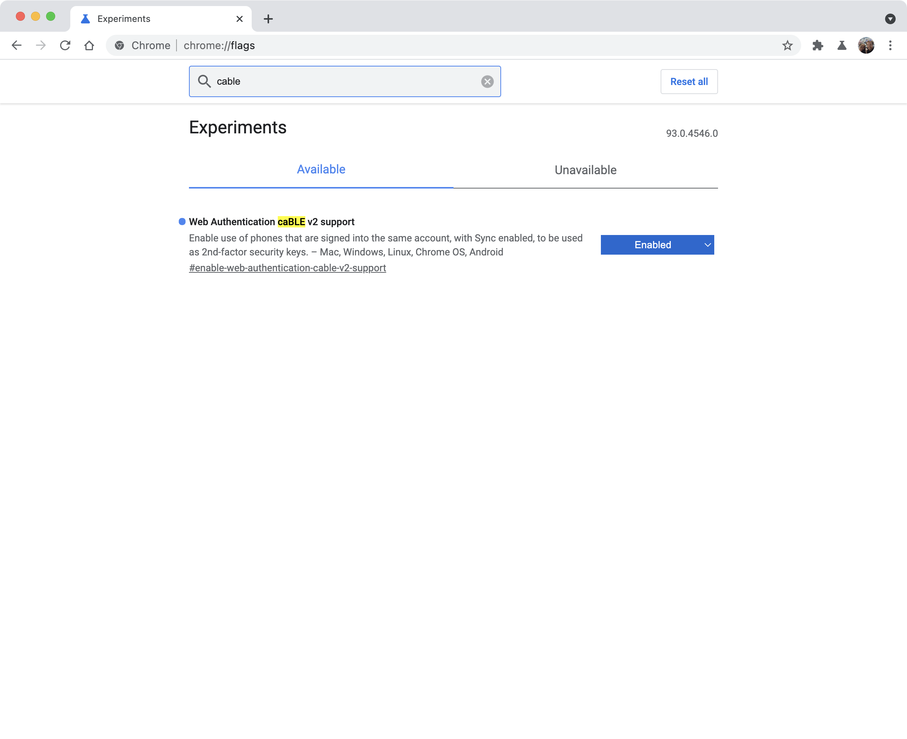
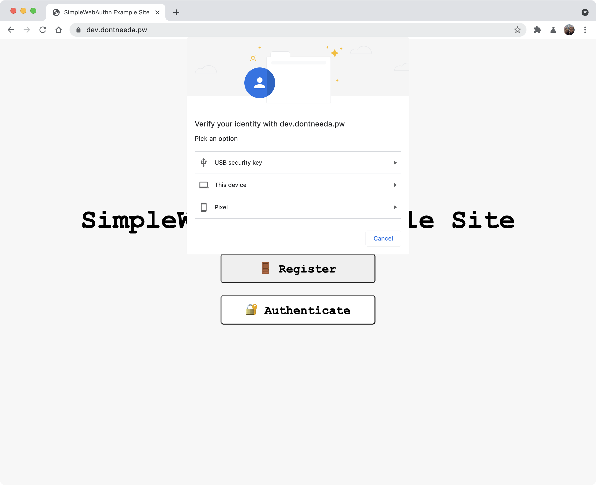
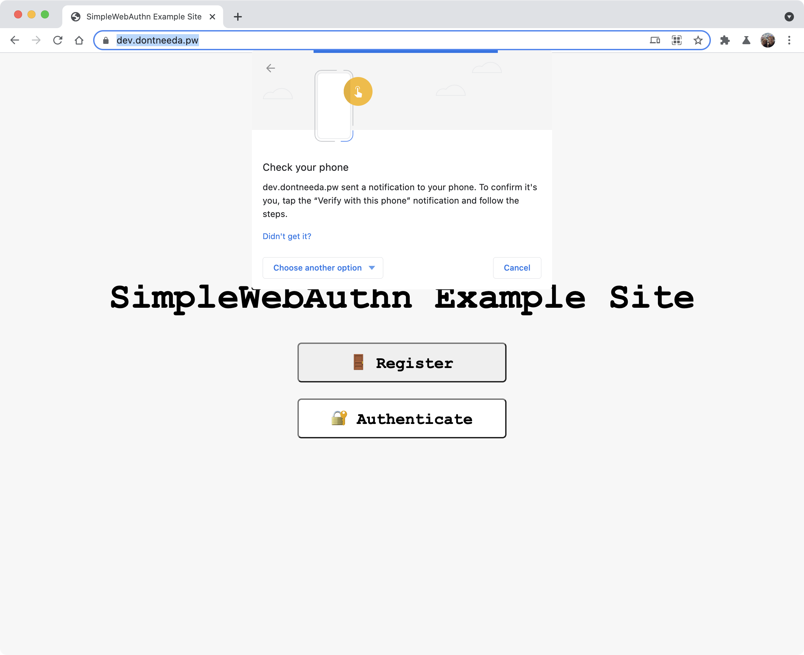
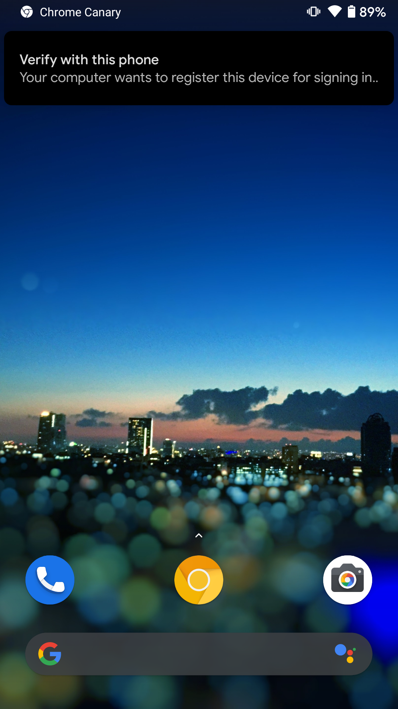
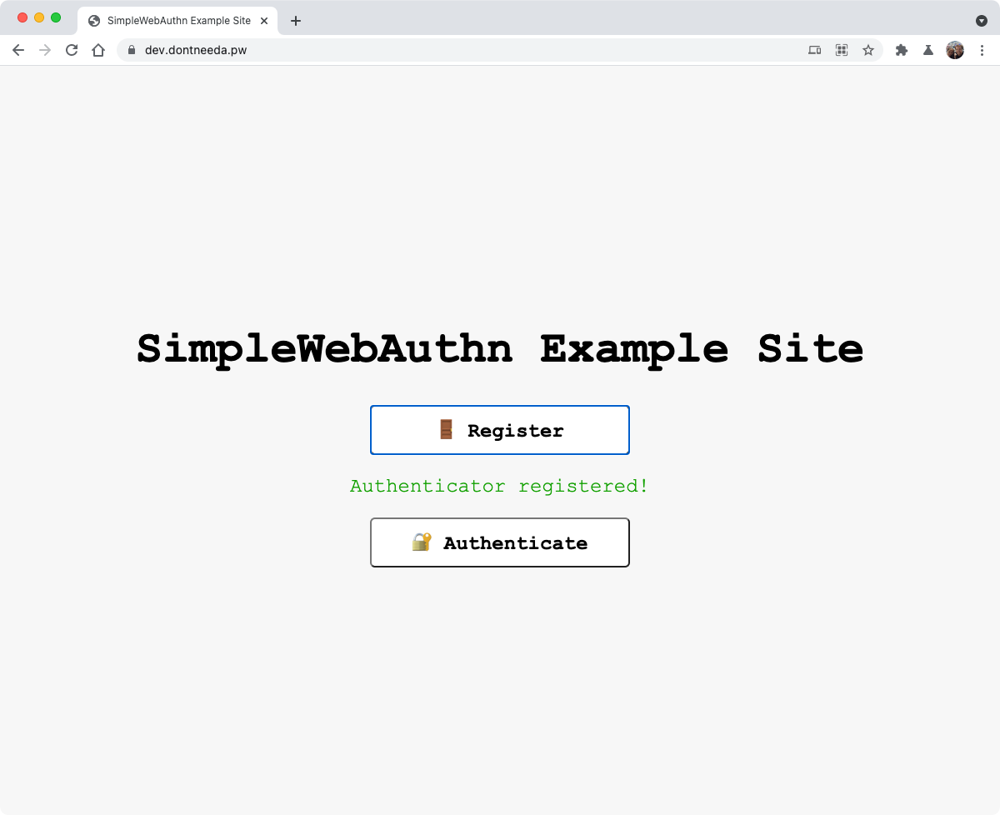

+++
title = "Previewing Chrome's WebAuthn support for caBLE v2"
description = "Observations of Google's experiment with Android phones as WebAuthn authenticators"
date = "2021-06-18T23:47:54.546Z"
categories = ["webauthn"]
keywords = ["chrome", "android", "webauthn", "cable", "bluetooth"]
hasCode = true
+++

A [recent post in the fido-dev Google Group](https://groups.google.com/a/fidoalliance.org/g/fido-dev/c/go6GoFW27Dw/m/9flCLR5pBQAJ?pli=1) included steps for previewing work Google is doing with ["Cloud-assisted BLE" pairing, or caBLE v2](https://github.com/fido-alliance/fido-2-specs/pull/724). Briefly, Google is working on a way of pairing Android devices to bluetooth-equipped computers in a way that sidesteps the usual Bluetooth pairing process most of us suffer through when we pair our headphones to our laptops.

The steps listed on the fido-dev post are specifically for testing out caBLE v2 in the context of WebAuthn. While the technology is still very much a WIP, it's built out enough to allow for WebAuthn registration and authentication ceremonies. I decided to take it out for a spin to see what kind of extra work, if any, RP devs might need to one day be aware of to implement support for this.

## Setup

Support for caBLE exists today in **Chrome Canary Version 93.0.4530.0 and up**, both on Android, and macOS, Windows, and Chrome OS devices with Bluetooth. And in a surprising bit of backwards compatibility, this version of caBLE works with **Android devices running Android 7**!

For the record, I tested this all out with macOS Chrome Canary Version 93.0.4548.0, and my Pixel 1 running the latest Android 10.

Setup instructions below are copied verbatim from the fido-dev post above:
### Setting up your Android device

1. Install Chrome Canary afresh from the [Play Store](https://play.google.com/store/apps/details?id=com.chrome.canary). (Uninstall/reinstall if already installed.)
1. Open Canary. In the new user flow, decline to enable syncing.
1. Navigate to **chrome://version** and ensure that the version is >= 93.0.4530.0.
1. Navigate to **chrome://flags** and search for **"cable"**.
2. Enable **"Web Authentication caBLE v2 support"** and relaunch Canary with the button at the bottom.
3. In Canary, use the three-dots menu (top right) to enter Canary's settings.
4. Enable Sync (it’s at the top of the settings page).
5. Leave the phone for a minute to sync up.

### Setting up your macOS, Windows, or Chrome OS device

1. Install [Chrome Canary](https://www.google.com/chrome/canary/) (Or update to the latest version.)
1. Navigate to **chrome://version** and ensure that the version is >= 93.0.4530.0
1. Sign into the same account as the phone is syncing to, for example by going to [accounts.google.com](https://myaccount.google.com/).
2. Select the account menu in Canary—a circular icon at the top right. If it doesn’t already indicate that Sync is enabled then click **"Turn on sync…"** and **"Yes I’m in"**.
3. Open **chrome://flags** and search for **"cable"**.
4. Enable **"Web Authentication caBLE v2 support"** and relaunch Canary with the button at the bottom.



## Observations

After setting everything up I spun up the example project I maintain within my [SimpleWebAuthn](https://simplewebauthn.dev/) project and used it for testing. In lieu of this, you should be able to experience this yourself with a site like this [WebAuthn Test App](https://webauthntest.azurewebsites.net/).

### WebAuthn Registration

Start the WebAuthn registration process as usual. No special registration options are required. Chrome will show "Pixel" as an authenticator option along with the usual "Security Key" and "This Device" platform authenticator option:



> NOTE: caBLE is a "cross-platform" authenticator attachment. It will **not** be available if `authenticatorSelection.authenticatorAttachment` is set to `"platform"` in registration options.

Select "Pixel", at which point Chrome will instruct you to check your phone for a notification:



Unlock your Android device to receive that notification asking you to "verify with this phone":



Tapping the notification brings up a full-screen view with a lock and spinning color wheel while Android is "connecting to your device." A second later, a half-height "Verify your identity" popup appears prompting you to interact with your device's biometric sensor (or enter a PIN, if a biometric sensor is unavailable):


Once you complete the biometric gesture/PIN entry, you're done! Go back to Chrome to confirm that the WebAuthn registration completed successfully:



And that's it. In just a few clicks, without any prior pairing, your phone and computer are able to securely connect and interact on-demand thanks to Google and their "cloud-assisted BLE" network transport.

### WebAuthn Authentication

I wanted to document the entire WebAuthn authentication flow as well but honestly it's almost identical to registration. The only difference I noticed was slightly different wording on the Android notification - it says "use this device to sign in" instead of "register this device for signing in":


## WebAuthn API Response Analysis

From a technical perspective there's nothing too surprising coming out of this version of caBLE-based registration ([SimpleWebAuthn Debugger link](https://debugger.simplewebauthn.dev/?attestation=ewogICJpZCI6ICJBYVM4amV5VzZiX2xXY1FCdGd3VEpKTWc4UHlhNmp5QmFMd2U3SExVQXNMVDdxZ21DUGh4N1BTT2pwcU8wTFBxOVhFaXh2STZaMnp1LXZULTdsYVB6SjAiLAogICJyYXdJZCI6ICJBYVM4amV5VzZiX2xXY1FCdGd3VEpKTWc4UHlhNmp5QmFMd2U3SExVQXNMVDdxZ21DUGh4N1BTT2pwcU8wTFBxOVhFaXh2STZaMnp1LXZULTdsYVB6SjAiLAogICJyZXNwb25zZSI6IHsKICAgICJhdHRlc3RhdGlvbk9iamVjdCI6ICJvMk5tYlhSa2JtOXVaV2RoZEhSVGRHMTBvR2hoZFhSb1JHRjBZVmpGUGR4SEVPbkFpTElwMjZpZFZqSWd1em4zSXByX1Jsc0taV3NhLTVxSy1LQkZBQUFBQUFBQUFBQUFBQUFBQUFBQUFBQUFBQUFBUVFHa3ZJM3NsdW1fNVZuRUFiWU1FeVNUSVBEOG11bzhnV2k4SHV4eTFBTEMwLTZvSmdqNGNlejBqbzZhanRDejZ2VnhJc2J5T21kczd2cjBfdTVXajh5ZHBRRUNBeVlnQVNGWUlPeUtadTNDWG1NZ3cycFVpTFVaeDVIaWpkTHJLb0NPS2FteDc4cXV6di1DSWxnZ0ppOG9qNTNZcFJYQS1jcTZBSlpTZnkxYTAxZnNvcG9EdXpfSzNYMlJFbGciLAogICAgImNsaWVudERhdGFKU09OIjogImV5SjBlWEJsSWpvaWQyVmlZWFYwYUc0dVkzSmxZWFJsSWl3aVkyaGhiR3hsYm1kbElqb2lVbTU1VkVkb1VuaHVWRW8xVUhkelEybDJSVzlrVEdFMU9HWlBYMmRVY2s4NVV6TnFkM0kwVm5GdVdTSXNJbTl5YVdkcGJpSTZJbWgwZEhCek9pOHZaR1YyTG1SdmJuUnVaV1ZrWVM1d2R5SXNJbU55YjNOelQzSnBaMmx1SWpwbVlXeHpaWDAiCiAgfSwKICAidHlwZSI6ICJwdWJsaWMta2V5IiwKICAidHJhbnNwb3J0cyI6IFsiY2FibGUiXQp9)):

```json
{
  "id": "AaS8jeyW6b_lWcQBtgwTJJMg8Pya6jyBaLwe7HLUAsLT7qgmCPhx7PSOjpqO0LPq9XEixvI6Z2zu-vT-7laPzJ0",
  "rawId": "AaS8jeyW6b_lWcQBtgwTJJMg8Pya6jyBaLwe7HLUAsLT7qgmCPhx7PSOjpqO0LPq9XEixvI6Z2zu-vT-7laPzJ0",
  "response": {
    "clientDataJSON": {
      "type": "webauthn.create",
      "challenge": "RnyTGhRxnTJ5PwsCivEodLa58fO_gTrO9S3jwr4VqnY",
      "origin": "https://dev.dontneeda.pw",
      "crossOrigin": false
    },
    "attestationObject": {
      "fmt": "none",
      "attStmt": {},
      "authData": {
        "rpIdHash": "PdxHEOnAiLIp26idVjIguzn3Ipr_RlsKZWsa-5qK-KA",
        "flags": {
          "userPresent": true,
          "userVerified": true,
          "attestedData": true,
          "extensionData": false
        },
        "counter": 0,
        "aaguid": "00000000-0000-0000-0000-000000000000",
        "credentialID": "AaS8jeyW6b_lWcQBtgwTJJMg8Pya6jyBaLwe7HLUAsLT7qgmCPhx7PSOjpqO0LPq9XEixvI6Z2zu-vT-7laPzJ0",
        "credentialPublicKey": "pQECAyYgASFYIOyKZu3CXmMgw2pUiLUZx5HijdLrKoCOKamx78quzv-CIlggJi8oj53YpRXA-cq6AJZSfy1a01fsopoDuz_K3X2RElg",
        "parsedCredentialPublicKey": {
          "keyType": "EC2 (2)",
          "algorithm": "ES256 (-7)",
          "curve": 1,
          "x": "7Ipm7cJeYyDDalSItRnHkeKN0usqgI4pqbHvyq7O_4I",
          "y": "Ji8oj53YpRXA-cq6AJZSfy1a01fsopoDuz_K3X2RElg"
        }
      }
    }
  },
  "type": "public-key",
  "transports": ["cable"]
}
```

Highlights include:

- The credential public key uses typical ES256
- The User Verification flag is set to `true` thanks to the biometric/PIN interaction
- The attestation statement format is always `"none"`, even when `"direct"` attestation is requested
- `getTransports()` returns an array with a new `"cable"` transport

## In Conclusion

One of WebAuthn's notable "weakpoints" is its lack of an account recovery story. After all, what good is a credential public key if the authenticator containing its paired private key is lost or replaced? Private keys can't be transferred to a new device by design. It's the responsibility of RP developers, then, to architect and implement sufficient out-of-band account ownership verification processes lest their users permanently lose account access because they "failed" to upgrade their phone without registering it while they had access to their old device (because *obviously* a user should know to do this! /s)

Technology like Google's caBLE v2 preview and Apple's new Passkey technology preview both seem to be trying to tackle this issue by keeping credential private keys in the cloud. After all if private keys are stored in the cloud then Google and Apple are free to orchestrate access to them from any user's device, even if the user no longer has access to the device they originally completed WebAuthn registration with. It's unclear to me from this experiment with caBLE v2, though, how Google will maintain the user's private keys: mentions of "syncing" in the setup instructions give me the impression that Google might actually synchronize the private key between devices. This may be inaccurate as caBLE is not well-documented, probably due to it's in-development status.

One final thought: it's worth mentioning how fundamentally cloud-based storage of private keys breaks the FIDO2 security model that assumes private keys never leave a secure device. Conversations have already popped up in the FIDO2 and W3C communities about this, and discussion will only intensify as companies like Google and Apple continue striving to strike that fine balance between security and usability.
